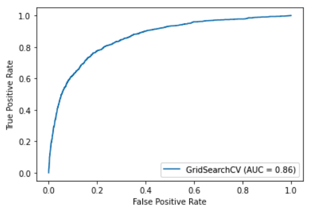
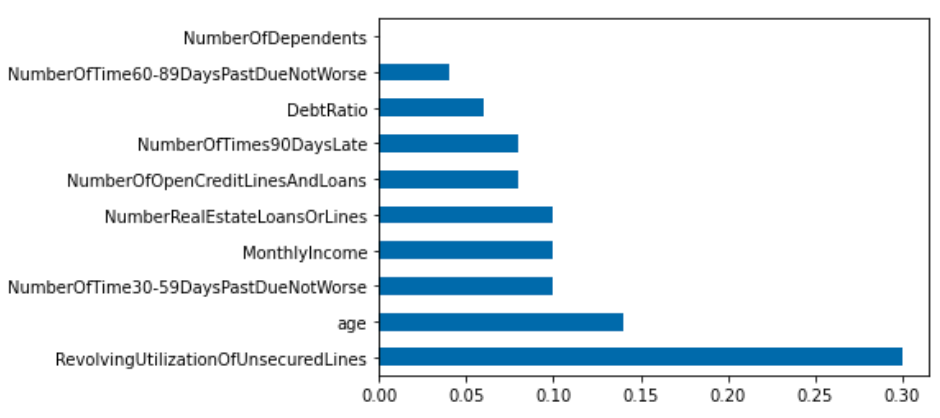
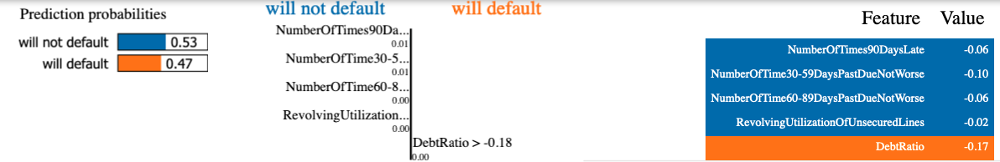

# [Give me Some Credit Kaggle Project](https://www.kaggle.com/c/GiveMeSomeCredit/data)
- Main exploration is in notebooks/Give Me Some Credit.ipynb

## Tell us how you validate your model, and why you chose such evaluation technique
Model validation is done by selecting the model with the highest AUC. Quite simply, AUC is chosen because it is the target of the competition. Another possible evaluation metric is the F1 score. 

# What is the AUC? 
AUC is the area under the ROC (Receiver Operating Curve). It is a graph of true positive rate against the false positive rate. It shows the performance of the classification model across all classification thresholds. 

ROC AUC is the probability that the model ranks a random positive example more highly than a random negative example. 

It might not be desirable when
- The desired output needs to be well-calibrated. [Sources: [1](https://sinyi-chou.github.io/classification-auc/) [2](https://neptune.ai/blog/f1-score-accuracy-roc-auc-pr-auc) [3](https://www.youtube.com/watch?v=RXMu96RJj_s)]
- The data is heavily imbalanced. [4](https://stats.stackexchange.com/questions/262616/roc-vs-precision-recall-curves-on-imbalanced-dataset)

# Why is this chosen as an evaluation metric for this competition?
The model’s business goal is to catch those who are likely to default, out of those who wouldn’t. The business wants to minimize false positive rate (i.e. rejecting good borrowers) and maximizing true positive rate (ie rejecting bad borrowers). The AUC can tell us exactly that (at regions of FPR). 

# What are other metrics that would be suitable for this? Other metrics that can replace:
F1 score, since we are dealing with imbalanced classes.
Precision Recall Curve (which is good for when cases are imbalanced)

# What insight(s) do you have from your model? What is your preliminary analysis of the given dataset?
From the feature importance curve, we see that revolving utilization of unsecured lines has the highest feature importance. The closer a person is to hitting their credit limit, the more likely they are to be delinquent.

We can also use LIME to explain the prediction of a single point. For instance, the model predicted that there is a 53% chance that this person will not default because their score on the NumberOfTimes90DaysLate is lower than average, among other features.

## Can you get into the top 100 of the private leaderboard, or even higher?
Unfortunately, no. We could try some Auto-ML tools for parameter tuning and more feature engineering for that.

## Additional notes
I organized this folder as if it is a POC to a production ML project that runs in batches. Admittedly, the codes in the .py files are dummy code, but they illustrate how we can organize the files in a way that allows for model retraining and prediction without using a notebook. 
